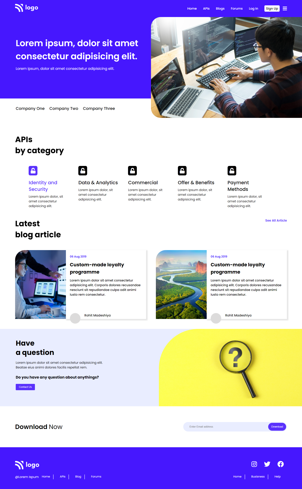

# Hey Welcome Buddy 👋

This is Rohit Madeshiya. Passionate to become a Full Stack Developer.

## Project Name : **Developer landing Page !**

In this project i have created Developer landing page. Technologies which I used to create this Page is HTML and CSS. I have learnt a new thing while creating this project and that is a Float property of CSS. I have made it responsive as well using media queries.

 

# 💻 Tech Stack Used :

  !

 

### My Project is looking like :

### You can Check it Live on Below Link :

[Live Link !](https://developer-landing-page-rohit.netlify.app/)
